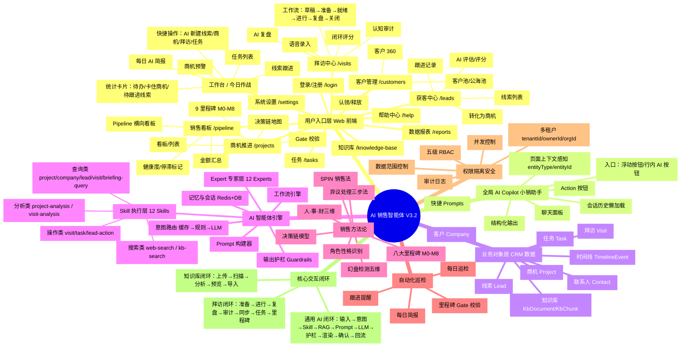

# AI 销售智能体 · 功能模块与交互逻辑思维导图

> 版本：V3.2.0  
> 用途：梳理软件交互逻辑与模块严谨性  
> 说明：本文档包含「Markdown 层级版」和「Mermaid 思维导图版」两套视图，可直接复制到支持 Mermaid 的编辑器渲染。

---

## 一、Markdown 层级版（可直接粘贴到思维导图软件）

```text
AI 销售智能体系统（V3.2）
├── 1. 用户入口层（Web 前端）
│   ├── 工作台 / 今日作战
│   │   ├── 每日 AI 简报
│   │   ├── 快捷操作入口
│   │   │   ├── AI 新建线索
│   │   │   ├── AI 新建商机
│   │   │   ├── AI 新建拜访
│   │   │   └── AI 新建任务
│   │   ├── 统计卡片
│   │   │   ├── 今日待办
│   │   │   ├── 卡住商机
│   │   │   ├── 待跟进线索
│   │   │   └── AI 简报
│   │   ├── 任务列表（逾期/今日/高优/待办）
│   │   ├── 商机预警卡片（门控阻塞/陈旧/低健康/紧急）
│   │   └── 线索跟进卡片（活跃/长期逾期）
│   ├── 获客中心 /leads
│   │   ├── 线索列表（搜索/状态筛选/等级筛选）
│   │   ├── AI 评估与评分
│   │   ├── 转化条件检查
│   │   ├── 跟进记录
│   │   ├── 时间线
│   │   ├── 转化为商机
│   │   └── 标记流失
│   ├── 拜访中心 /visits
│   │   ├── 拜访列表
│   │   ├── 语音录入（浏览器 ASR / 云端 SenseVoice）
│   │   ├── AI 复盘
│   │   ├── 认知审计（DynamicContextAgent）
│   │   ├── 拜访闭环评分
│   │   ├── 完成拜访
│   │   └── 工作流阶段：草稿 → 准备 → 就绪 → 进行 → 复盘 → 关闭
│   ├── 客户管理 /customers
│   │   ├── 客户池（全部/公海池/我的客户）
│   │   ├── 认领/释放客户
│   │   └── 客户 360 Drawer（统计/风险/关联商机/联系人/拜访/任务/动态）
│   ├── 联系人 /contacts
│   │   ├── 联系人列表
│   │   ├── 决策角色标注（Coach/Evaluator/Decision Maker/User/Gatekeeper）
│   │   └── 决策画像（个人动机/ROI 关切/接触策略）
│   ├── 商机推进 /projects
│   │   ├── 看板/列表双视图
│   │   ├── 9 里程碑进度（M0-M8）
│   │   ├── 里程碑门控校验
│   │   ├── 阶段标准动作清单
│   │   ├── 决策链地图
│   │   ├── 关联拜访/任务
│   │   └── 推进/编辑/删除
│   ├── 销售看板 /pipeline
│   │   ├── 全 Pipeline 横向看板
│   │   ├── 按里程碑阶段分布
│   │   ├── 预估金额汇总
│   │   ├── 健康度评分
│   │   └── 停滞标记
│   ├── 任务 /tasks
│   │   ├── 任务列表（状态/优先级筛选/搜索）
│   │   ├── 标记完成
│   │   └── 来源标记（跟进提醒/拜访提醒/AI 提取/线索跟进/公海池释放/停滞提醒/巡检等）
│   ├── 知识库 /knowledge-base
│   │   ├── 文件拖拽上传（PDF/Word/TXT/MD/CSV）
│   │   ├── 语义检索
│   │   ├── AI 分析文件
│   │   ├── 实体提取预览（客户/线索/商机/联系人）
│   │   └── 批量导入 CRM
│   ├── 数据报表 /reports
│   │   ├── 销售漏斗统计
│   │   ├── 里程碑分布柱状图
│   │   ├── 高优先级商机
│   │   ├── AI 巡检预警列表
│   │   └── AI 整体复盘入口
│   ├── 系统设置 /settings
│   │   ├── 外观主题
│   │   ├── AI 配置（模型/Embedding/语音/搜索 API）
│   │   ├── 销售方法论配置（里程碑/SPIN/人物画像）
│   │   ├── 成员角色管理
│   │   └── 数据导出 CSV
│   ├── 帮助中心 /help
│   │   ├── 帮助文档章节树
│   │   ├── 搜索帮助内容
│   │   └── Markdown 渲染
│   └── 登录/注册 /login
│       ├── 邮箱密码登录
│       ├── 注册（支持创建租户）
│       ├── Token 存储
│       └── 设备踢出提示
│
├── 2. 全局 AI Copilot（小销助手）
│   ├── 入口
│   │   ├── 右下角浮动按钮（Bot 图标）
│   │   ├── 页面行内 AI 入口按钮（AiEntryButton）
│   │   └── 页面上下文自动注入（entityType/entityId）
│   ├── 主面板
│   │   ├── 右侧浮动聊天面板
│   │   ├── 会话历史（懒加载/分页）
│   │   ├── 消息分组（按日期）
│   │   ├── 快捷 Prompts
│   │   ├── 结构化输出渲染
│   │   ├── Action 按钮（创建任务/拜访/线索/提醒/导航）
│   │   ├── 复制/重生成/反馈
│   │   └── 拖拽调整宽度
│   └── 状态管理
│       └── copilot-store（面板显隐）
│
├── 3. 业务对象层（CRM 数据模型）
│   ├── 线索 Lead
│   │   ├── 状态机：ACTIVE / CONVERTED / LOST / PAUSED
│   │   ├── AI 提取字段：aiExtracted / confidenceScore / completenessScore / missingFields
│   │   ├── 评分：score / grade / assessedBy
│   │   └── 关联：LeadFollowUp / LeadAssessmentJob
│   ├── 客户 Company
│   │   ├── 行业/规模/区域/等级
│   │   ├── 负责人 ownerId / assignedAt
│   │   └── 关联：Project / Contact
│   ├── 联系人 Contact
│   │   ├── 职位/决策角色/联系方式
│   │   ├── 个人动机（personalMotive）
│   │   └── AI 标记：aiTagged / roleConfidence
│   ├── 商机 Project
│   │   ├── 里程碑 milestone（M0-M8）
│   │   ├── 金额 amount
│   │   ├── 紧急度 urgency
│   │   ├── 健康度 healthScore / healthRadar
│   │   ├── 赢单概率 winProbability / probabilityConfidence
│   │   ├── 下次跟进 nextFollowUp
│   │   ├── 停滞标记 isStale / staleSince / staleReason
│   │   ├── 证据链 evidenceChain
│   │   ├── 决策地图 decisionMap
│   │   └── 关联：Visit / Task / TimelineEvent / ProjectContact / CustomerSnapshot
│   ├── 拜访 Visit
│   │   ├── 拜访时间/类型/场景
│   │   ├── 语音转写 audioTranscript
│   │   ├── AI 分析 aiAnalysis
│   │   ├── 提取任务 extractedTasks
│   │   ├── 里程碑变更 milestoneBefore / milestoneAfter
│   │   ├── 工作流阶段 workflowStage
│   │   └── 关联：VisitClosure
│   ├── 任务 Task
│   │   ├── 优先级 priority
│   │   ├── 状态 status：PENDING / IN_PROGRESS / COMPLETED / CANCELLED
│   │   ├── 截止日期 deadline
│   │   ├── 来源 source / sourceId
│   │   └── 完成时间 completedAt
│   ├── 时间线 TimelineEvent
│   │   ├── 事件类型 eventType
│   │   ├── 认知载荷 cognitivePayload
│   │   ├── 数据变更 mutations
│   │   ├── 转写地址 transcriptUrl
│   │   └── AI 洞察 aiInsight
│   └── 知识库 KbDocument
│       ├── 文件 metadata
│       ├── 分块 KbChunk（含向量 embedding）
│       └── 范围 scope：PERSONAL / TEAM / TENANT
│
├── 4. AI 智能体引擎层（后端）
│   ├── 意图路由 Intent Router
│   │   ├── 三层架构：Redis 缓存 → 规则兜底 → LLM 分类
│   │   ├── 14 种意图分类
│   │   ├── 复合意图拆分 splitCompositeIntents
│   │   └── 输出约束：{ intent, confidence, entities, reasoning }
│   ├── Skill 执行层
│   │   ├── SkillRegistry 注册表
│   │   ├── Agent Skill Router（意图 → Skill ID 映射）
│   │   ├── 并行执行 Promise.all
│   │   ├── 12 个 Skill
│   │   │   ├── 搜索类
│   │   │   │   ├── web-search：Tavily/Bing 网络搜索
│   │   │   │   └── kb-search：知识库语义搜索
│   │   │   ├── 查询类
│   │   │   │   ├── project-query：商机查询/健康度
│   │   │   │   ├── company-query：客户/联系人查询
│   │   │   │   ├── lead-query：线索查询
│   │   │   │   ├── visit-query：拜访查询
│   │   │   │   └── briefing-query：今日简报聚合
│   │   │   ├── 操作类
│   │   │   │   ├── visit-action：创建拜访
│   │   │   │   ├── task-action：创建任务/提醒
│   │   │   │   └── lead-action：创建线索
│   │   │   └── 分析类
│   │   │       ├── project-analysis：认知审计/里程碑 Gate/风险/NBA
│   │   │       └── visit-analysis：拜访分析/决策链/里程碑/风险
│   ├── Expert 专家层
│   │   ├── 12 个 Expert Agent
│   │   │   ├── territory-search：区域客户开发
│   │   │   ├── territory-expansion：陌生市场突破
│   │   │   ├── background-research：客户背景调研
│   │   │   ├── visit-prep：拜访准备
│   │   │   ├── visit-analysis：拜访复盘
│   │   │   ├── demand-mining：需求挖掘
│   │   │   ├── follow-up：跟进策略
│   │   │   ├── lead-assessment：线索评估
│   │   │   ├── team-management：团队管理
│   │   │   ├── illusion-detection：幻盘检测
│   │   │   ├── sales-coaching：销售辅导
│   │   │   └── bidding-monitor：招投标监测
│   ├── Prompt 构建器
│   │   ├── System Prompt 注入
│   │   ├── 业务框架注入（区域开发/背景调研/拜访准备/拜访复盘）
│   │   ├── 方法论动态加载（MethodologyConfig）
│   │   ├── 边界约束（8 条安全约束）
│   │   ├── 实体链接格式 [实体](entity://type/id)
│   │   └── 实时数据区块
│   ├── 记忆与会话
│   │   ├── Redis 短期记忆（7 天 TTL，最近 50 轮）
│   │   ├── DB 为 Source of Truth
│   │   ├── 页面上下文 pageContext
│   │   └── ChatSession / ChatMessage
│   ├── 输出护栏 Guardrails
│   │   ├── 编造模式检测（12 组正则）
│   │   ├── 过度承诺检测
│   │   ├── 权限夸大检测
│   │   ├── 工具参数校验
│   │   ├── 扫描时机：LLM 输出完成后
│   │   └── 处理：warn / block
│   └── 工作流引擎
│       ├── 每日巡检 daily-scan
│       ├── 跟进提醒生成 follow-up-reminders
│       └── 每日简报 briefing
│
├── 5. 销售方法论层
│   ├── 八大里程碑 M0-M8
│   │   ├── Gate 规则定义
│   │   ├── 字段校验
│   │   ├── 证据链要求
│   │   └── 推进阻断/通过机制
│   ├── 决策链模型
│   │   ├── 三角色：Coach / Evaluator / Decision Maker
│   │   ├── SKU1 通识课：四级链
│   │   ├── SKU2 学科交叉：两级链
│   │   └── SKU3 科研平台：两级链 + 经费窗口
│   ├── SPIN 销售法
│   │   ├── 拜访准备：S/P/I/N 四层问题
│   │   └── 拜访复盘：SPIN 挖掘深度评估
│   ├── 人·事·财三维透视
│   │   ├── 人：决策链/态度
│   │   ├── 事：痛点/需求/竞品
│   │   └── 财：预算/审批路径
│   ├── 幻盘检测五维模型
│   │   ├── 需求真实性 25%
│   │   ├── 决策链完整性 25%
│   │   ├── 预算真实性 25%
│   │   ├── 竞品信号 15%
│   │   └── 时间窗口 10%
│   ├── 异议处理三步法
│   │   ├── 认同缓冲
│   │   ├── 探究根因
│   │   └── 价值重构
│   └── 角色性格识别（猫头鹰/老虎/孔雀/考拉）
│
├── 6. 自动化/巡检层
│   ├── 每日巡检
│   │   ├── 停滞项目自动标记（14 天无拜访 + 7 天无任务）
│   │   ├── 停滞分级预警（0-14 天 MEDIUM / >14 天 HIGH）
│   │   ├── 长期未转化线索（>30 天）
│   │   ├── 逾期任务
│   │   ├── 即将到期任务（3 天内）
│   │   ├── 低健康度项目（<40 分）
│   │   ├── 缺少拜访项目（>14 天）
│   │   ├── HIGH 预警自动转任务
│   │   ├── nextFollowUp / nextActionDeadline 到期提醒
│   │   ├── 公海池 72h 未触达自动释放
│   │   └── 停滞项目超 3 天通知主管
│   ├── 跟进提醒
│   │   ├── nextFollowUp 到期 → 任务
│   │   ├── visitNextAction 到期 → 任务
│   │   └── 停滞项目 → 主管通知
│   ├── 每日简报
│   │   ├── 规则引擎生成（不依赖 LLM）
│   │   ├── TOP 3 优先动作
│   │   ├── AI 洞察
│   │   └── 统计指标
│   └── 里程碑 Gate 校验
│       ├── 动态加载 Gate 规则
│       ├── 字段值非空校验
│       ├── 证据链校验
│       ├── 阻断时生成补全任务
│       └── 通过时更新 Project + TimelineEvent
│
├── 7. 权限/隔离/安全层
│   ├── 多租户隔离
│   │   ├── Tenant 为顶层隔离
│   │   ├── Prisma Proxy 自动注入 tenantId
│   │   ├── 自动注入 ownerId / orgId
│   │   └── 索引模式 @@index([tenantId, orgId])
│   ├── 五级角色 RBAC
│   │   ├── SUPER_ADMIN：超级管理员
│   │   ├── TENANT_ADMIN：租户管理员
│   │   ├── DEPT_HEAD：部门负责人
│   │   ├── SALES：销售
│   │   └── VIEWER：只读查看者
│   ├── 数据范围控制
│   │   ├── SUPER_ADMIN/TENANT_ADMIN：全租户
│   │   ├── DEPT_HEAD：本部门 orgId
│   │   └── SALES/VIEWER：仅 ownerId
│   ├── 审计与安全
│   │   ├── AuditLog 全量操作审计
│   │   ├── LoginHistory 登录尝试记录
│   │   ├── 工具调用审计
│   │   └── 文件上传内容安全扫描
│   └── 并发控制
│       ├── 全局 LLM 并发限制（默认 20）
│       ├── 单用户并发限制（默认 3）
│       └── FIFO 队列机制
│
└── 8. 核心交互闭环
    ├── 通用 AI 交互闭环
    │   ├── 用户输入
    │   ├── 页面上下文/实体上下文注入
    │   ├── 意图路由（缓存→规则→LLM）
    │   ├── Skill 并行执行
    │   ├── RAG 知识库检索
    │   ├── Prompt 构建（方法论+约束+实时数据）
    │   ├── LLM 流式生成
    │   ├── 输出护栏扫描
    │   ├── 结构化渲染 + 实体可点击链接
    │   ├── 用户确认/Action 点击
    │   └── 数据回流 CRM
    ├── 拜访工作流闭环
    │   ├── 拜访准备（AI 情报+SPIN+异议库）
    │   ├── 拜访进行（语音录入/Copilot 流）
    │   ├── 拜访复盘（AI 分析六维度）
    │   ├── 认知审计（DynamicContextAgent）
    │   ├── 实体同步确认/忽略
    │   ├── 自动生成任务
    │   └── 推进商机里程碑
    └── 知识库→CRM 闭环
        ├── 文件上传
        ├── 内容安全扫描
        ├── AI 分析/实体提取
        ├── 预览确认
        └── 批量导入 CRM
```

---

## 二、Mermaid 思维导图版



---

## 三、模块严谨性检查清单

| 维度 | 已实现机制 | 关键文件/位置 |
|------|-----------|--------------|
| 数据隔离 | tenantId/ownerId/orgId 自动注入 Prisma Proxy | `tenant/tenant-guard.ts` |
| 权限控制 | 5 级角色 + `requireRoles` + `useHasRole` | `plugins/rbac.plugin.ts`, `use-permission.ts` |
| AI 反编造 | 12 组正则扫描 + 8 条 Prompt 边界 | `agents/core/guardrails.ts`, `prompt-builder.ts` |
| 工具安全 | 禁止空 where 批量操作、工具调用审计 | `agents/core/guardrails.ts` |
| 并发保护 | 全局 20 + 单用户 3 的 FIFO 限流 | `infra/concurrency-limiter.ts` |
| 意图稳定 | 缓存 + 规则兜底 + LLM 三层路由 | `agents/core/agent-router.ts`, `intent-rules.ts` |
| 方法论一致 | MethodologyConfig 配置化 + Prompt 动态注入 | `methodology/`, `prompt-builder.ts` |
| 里程碑严谨 | Gate 规则字段+证据链双重校验 | `milestone-gate/gate-validator.ts` |
| 自动化可靠 | 规则引擎生成简报，不依赖 LLM | `agents/workflows/briefing.ts` |
| 操作可审计 | AuditLog/LoginHistory/工具调用全记录 | `infra/audit.middleware.ts` |
| 人机回环 | AI 预填 → 用户确认 → 才真正写入 CRM | `agents/enroll.controller.ts`, `visits confirm-sync` |
| 会话持久 | Redis 短期记忆 + DB Source of Truth | `agents/core/agent-memory.ts` |

---

## 四、可直接使用的文件

- **Markdown 层级版**：复制「一」中的代码块到 XMind / MindNode / 飞书思维笔记 / 语雀 即可自动识别层级。
- **Mermaid 版**：复制「二」中的代码块到支持 Mermaid 的编辑器（Notion、Obsidian、GitHub、GitLab、语雀代码块）即可渲染。

---

*生成时间：2026-06-26*  
*基于代码库扫描：apps/web、apps/api、prisma/schema、agents/core、agents/skills、agents/experts、agents/workflows*
