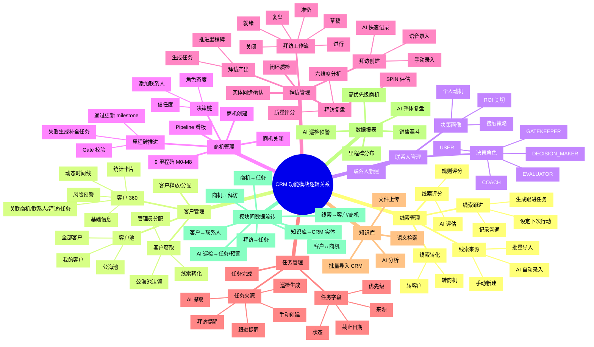
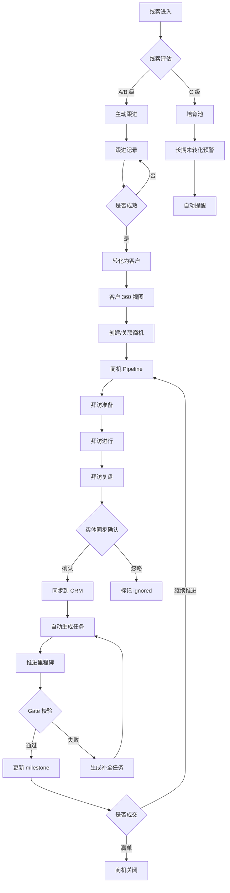

# CRM 功能模块逻辑关系与使用介绍思维导图

> 版本：V3.2.0  
> 用途：梳理 CRM 各功能模块的使用逻辑、数据流转与业务关系  
> 范围：线索、客户、联系人、商机、拜访、任务、知识库、报表八大 CRM 模块

---

## 一、Markdown 层级版

```text
CRM 功能模块逻辑关系
├── 1. 线索管理（获客入口）
│   ├── 线索来源
│   │   ├── 手动新建
│   │   ├── AI 自动录入（对话/文档提取）
│   │   ├── 批量导入
│   │   └── 外部渠道（可扩展）
│   ├── 线索列表
│   │   ├── 搜索（名称/公司/电话/邮箱）
│   │   ├── 状态筛选：ACTIVE / CONVERTED / LOST / PAUSED
│   │   ├── 等级筛选：A / B / C
│   │   └── 排序：评分/跟进时间/创建时间
│   ├── 线索详情
│   │   ├── 基础信息（公司/联系人/需求/来源）
│   │   ├── AI 评估结果（score/grade/missingFields）
│   │   ├── 跟进记录时间线
│   │   └── 操作按钮：转化/跟进/流失/编辑
│   ├── 线索跟进
│   │   ├── 记录沟通渠道（电话/邮件/微信/拜访/其他）
│   │   ├── 记录沟通结果
│   │   ├── 设定下次行动与截止时间
│   │   └── 自动生成跟进任务
│   ├── 线索评分
│   │   ├── 规则评分
│   │   └── AI 评估（BANT 四要素 + 7 步转化路线图）
│   └── 线索转化
│       ├── 转化为客户（Company）
│       ├── 转化为商机（Project）
│       └── 转换后线索状态变为 CONVERTED
│
├── 2. 客户管理（公海池与 360 视图）
│   ├── 客户池视图
│   │   ├── 全部客户
│   │   ├── 公海池（未认领客户）
│   │   └── 我的客户
│   ├── 客户获取
│   │   ├── 从公海池认领
│   │   ├── 管理员分配
│   │   └── 从线索转化自动创建
│   ├── 客户详情（客户 360）
│   │   ├── 基础信息（行业/规模/区域/等级）
│   │   ├── 负责人与分配历史
│   │   ├── 统计卡片
│   │   │   ├── 关联商机数
│   │   │   ├── 关联联系人数
│   │   │   ├── 历史拜访数
│   │   │   └── 待办任务数
│   │   ├── 风险预警
│   │   ├── 关联商机列表
│   │   ├── 关联联系人列表
│   │   ├── 关联拜访列表
│   │   ├── 关联任务列表
│   │   └── 客户动态时间线
│   ├── 客户释放
│   │   └── 销售可释放回公海池
│   └── 客户分配
│       └── 管理员/部门负责人分配给指定销售
│
├── 3. 联系人管理（决策链基础）
│   ├── 联系人新建
│   │   ├── 手动新建
│   │   ├── 从客户详情添加
│   │   └── 从拜访/商机分析中提取
│   ├── 联系人字段
│   │   ├── 基础信息（姓名/职位/电话/邮箱/微信）
│   │   ├── 决策角色
│   │   │   ├── COACH 引路人
│   │   │   ├── EVALUATOR 评估者
│   │   │   ├── DECISION_MAKER 决策者
│   │   │   ├── USER 使用者
│   │   │   └── GATEKEEPER 门卫
│   │   ├── 个人动机 personalMotive
│   │   ├── 态度 attitude
│   │   │   ├── SUPPORTIVE 支持
│   │   │   ├── NEUTRAL 中立
│   │   │   ├── RESISTANT 抵触
│   │   │   └── UNKNOWN 未知
│   │   └── AI 标记 aiTagged / roleConfidence
│   └── 决策画像
│       ├── ROI 关切
│       ├── 个人动机
│       └── 接触策略
│
├── 4. 商机管理（项目推进核心）
│   ├── 商机创建
│   │   ├── 手动新建
│   │   ├── 从线索转化
│   │   ├── 从客户详情创建
│   │   └── AI 自动提取
│   ├── 商机列表
│   │   ├── 列表视图
│   │   └── 看板视图（按里程碑分栏）
│   ├── 9 大里程碑 M0-M8
│   │   ├── M0 初步接触
│   │   ├── M1 需求确认
│   │   ├── M2 方案沟通
│   │   ├── M3 方案确认
│   │   ├── M4 商务谈判
│   │   ├── M5 合同签订
│   │   ├── M6 交付实施
│   │   ├── M7 验收回款
│   │   └── M8 赢单关闭
│   ├── 里程碑推进
│   │   ├── 点击推进
│   │   ├── Gate 校验（字段 + 证据链）
│   │   ├── 校验通过 → 更新 milestone
│   │   └── 校验失败 → 阻塞并生成补全任务
│   ├── 商机详情
│   │   ├── 基础信息（金额/紧急度/预计成交日）
│   │   ├── 健康度评分 healthScore
│   │   ├── 赢单概率 winProbability
│   │   ├── 停滞标记 isStale
│   │   ├── 下次跟进 nextFollowUp
│   │   ├── 决策链地图
│   │   ├── 关联拜访
│   │   ├── 关联任务
│   │   └── 时间线
│   ├── 决策链
│   │   ├── 添加项目联系人
│   │   ├── 设置角色与态度
│   │   ├── 设置信任度 trustLevel
│   │   ├── 决策时间线 decisionTimeline
│   │   └── 决策地图可视化
│   ├── 商机关闭
│   │   ├── 赢单 closedAt + winInfo
│   │   └── 输单 lostInfo
│   └── Pipeline 看板
│       ├── 按里程碑分组
│       ├── 预估金额汇总
│       ├── 健康度颜色标记
│       └── 停滞标记
│
├── 5. 拜访管理（销售动作落地）
│   ├── 拜访创建
│   │   ├── 手动录入
│   │   ├── 语音录入（浏览器 ASR / 云端 SenseVoice）
│   │   └── AI 快速记录
│   ├── 拜访关联
│   │   ├── 关联商机 Project
│   │   ├── 关联客户 Company
│   │   └── 关联联系人 Contact
│   ├── 拜访工作流
│   │   ├── DRAFT 草稿
│   │   ├── PREPARATION 准备（AI 生成拜访准备）
│   │   ├── READY 就绪
│   │   ├── IN_PROGRESS 进行（语音/Copilot 流）
│   │   ├── REVIEW 复盘（AI 分析）
│   │   └── CLOSED 关闭（闭环质检）
│   ├── 拜访准备
│   │   ├── 客户背景情报
│   │   ├── 决策链现状
│   │   ├── SPIN 问题清单
│   │   ├── 异议预判与话术
│   │   └── 物料清单
│   ├── 拜访进行
│   │   ├── 实时语音转写
│   │   ├── Copilot 实时洞察
│   │   └── 关键信息标记
│   ├── 拜访复盘
│   │   ├── AI 分析六维度
│   │   │   ├── 里程碑进展 milestoneProgress
│   │   │   ├── 决策链 decisionChain
│   │   │   ├── 关键信息 keyInfo（预算/时间线/竞品/痛点）
│   │   │   ├── 风险 risks
│   │   │   ├── 下一步行动 nextActions
│   │   │   └── 情绪 sentiment
│   │   ├── 质量评分 0-100
│   │   └── SPIN 挖掘深度评估
│   ├── 认知审计
│   │   └── DynamicContextAgent 复核拜访信息
│   ├── 闭环质检 VisitClosure
│   │   ├── 是否完成准备
│   │   ├── 是否有录音/转写
│   │   ├── 是否有总结
│   │   ├── 是否有 AI 分析
│   │   ├── 是否有跟进
│   │   └── 质量评分 qualityScore
│   ├── 实体同步确认
│   │   ├── AI 提取联系人/预算/痛点 → pending 预览
│   │   ├── 用户确认 → 同步到 CRM
│   │   └── 用户忽略 → 标记 ignored
│   └── 拜访产出
│       ├── 自动生成任务
│       ├── 推进商机里程碑
│       └── 写入 TimelineEvent
│
├── 6. 任务管理（行动驱动）
│   ├── 任务来源
│   │   ├── 手动创建
│   │   ├── 跟进提醒（nextFollowUp 到期）
│   │   ├── 拜访提醒（visitNextAction 到期）
│   │   ├── AI 提取（拜访/对话）
│   │   ├── 线索跟进
│   │   ├── 公海池释放提醒
│   │   ├── 停滞项目预警
│   │   └── 巡检自动生成
│   ├── 任务字段
│   │   ├── 标题/描述
│   │   ├── 优先级 LOW/MEDIUM/HIGH/URGENT
│   │   ├── 状态 PENDING/IN_PROGRESS/COMPLETED/CANCELLED
│   │   ├── 截止日期 deadline
│   │   ├── 来源 source/sourceId
│   │   └── 关联对象（客户/商机/拜访/线索）
│   ├── 任务视图
│   │   ├── 全部任务
│   │   ├── 我的任务
│   │   ├── 逾期任务
│   │   └── 今日到期
│   └── 任务完成
│       ├── 标记完成
│       ├── 记录完成时间
│       └── 反馈到关联对象状态
│
├── 7. 知识库（内容资产）
│   ├── 文件上传
│   │   ├── 支持格式：PDF/Word/TXT/MD/CSV
│   │   ├── 拖拽上传
│   │   └── 范围选择：PERSONAL/TEAM/TENANT
│   ├── 文件列表
│   │   ├── 按分类/标签筛选
│   │   ├── 搜索文件名
│   │   └── 删除
│   ├── 内容处理
│   │   ├── 文件解析
│   │   ├── 内容安全扫描
│   │   ├── 文本分块
│   │   └── 向量化（Embedding）
│   ├── 语义检索
│   │   ├── 输入问题
│   │   ├── 向量相似度匹配
│   │   └── 返回相关片段
│   ├── AI 分析文件
│   │   ├── 提取客户/线索/商机/联系人
│   │   ├── 生成预览 JSON
│   │   └── 批量导入 CRM
│   └── 使用场景
│       ├── 销售话术库
│       ├── 产品资料库
│       ├── 案例库
│       └── 培训材料库
│
├── 8. 数据报表（管理视角）
│   ├── 销售漏斗
│   │   ├── 各阶段商机数量
│   │   ├── 各阶段预估金额
│   │   └── 转化率
│   ├── 里程碑分布
│   │   └── 柱状图展示 M0-M8 分布
│   ├── 高优先级商机
│   │   └── 紧急/高金额/高健康度商机 TopN
│   ├── AI 巡检预警
│   │   ├── 停滞项目
│   │   ├── 逾期任务
│   │   ├── 长期未跟进线索
│   │   └── 低健康度商机
│   └── AI 整体复盘
│       └── 团队/个人 Pipeline 健康度分析
│
└── 9. 模块间核心数据流转
    ├── 线索 → 客户/商机
    │   ├── 线索转化时创建 Company
    │   └── 线索转化时创建 Project
    ├── 客户 ↔ 商机
    │   ├── 客户下创建商机
    │   └── 商机关联客户
    ├── 客户 ↔ 联系人
    │   ├── 客户下维护联系人
    │   └── 联系人可加入多个商机的决策链
    ├── 商机 ↔ 拜访
    │   ├── 拜访关联商机
    │   └── 拜访复盘推进商机里程碑
    ├── 商机 ↔ 任务
    │   ├── 商机下创建任务
    │   └── 任务完成反馈商机推进
    ├── 拜访 ↔ 任务
    │   ├── 拜访提取自动生成任务
    │   └── 任务完成后更新拜访闭环
    ├── 知识库 → CRM 实体
    │   ├── 文档分析提取客户 → 导入 Company
    │   ├── 文档分析提取线索 → 导入 Lead
    │   ├── 文档分析提取商机 → 导入 Project
    │   └── 文档分析提取联系人 → 导入 Contact
    └── AI 巡检 → 任务/预警
        ├── 停滞项目 → 任务 + 预警
        ├── 逾期线索 → 任务 + 预警
        ├── 逾期任务 → 预警
        └── nextFollowUp 到期 → 任务
```

---

## 二、Mermaid 思维导图版



---

## 三、CRM 核心业务流程图



---

## 四、模块使用说明速查表

| 模块 | 主要使用角色 | 核心用途 | 关键操作 | 产出 |
|------|------------|---------|---------|------|
| 线索管理 | 销售/销售主管 | 获客入口、潜在客户筛选 | 新建、跟进、评分、转化 | 合格客户/商机 |
| 客户管理 | 销售/部门负责人 | 客户资产沉淀、公海池流转 | 认领、分配、查看 360、释放 | 客户归属清晰 |
| 联系人管理 | 销售 | 构建决策链、识别关键人 | 新建联系人、标注决策角色 | 决策地图 |
| 商机管理 | 销售/销售主管 | 项目推进、Pipeline 可视 | 推进里程碑、维护决策链、关闭 | 阶段化赢单路径 |
| 拜访管理 | 销售 | 销售动作落地、信息采集 | 语音录入、AI 复盘、闭环质检 | 任务+里程碑推进 |
| 任务管理 | 销售 | 行动驱动、防止遗漏 | 创建、完成、筛选 | 执行闭环 |
| 知识库 | 全员 | 销售资料沉淀、AI 辅助 | 上传、检索、分析、导入 | CRM 实体/话术库 |
| 数据报表 | 管理者 | 业绩监控、风险识别 | 查看漏斗/预警/复盘 | 管理决策依据 |

---

## 五、模块间关系矩阵

| 源模块 | 目标模块 | 关系说明 |
|--------|---------|---------|
| 线索 | 客户 | 转化时创建客户 |
| 线索 | 商机 | 转化时创建商机 |
| 客户 | 商机 | 客户下可创建多个商机 |
| 客户 | 联系人 | 客户下维护联系人 |
| 联系人 | 商机 | 联系人加入商机的决策链 |
| 商机 | 拜访 | 拜访关联商机，支撑推进 |
| 商机 | 任务 | 任务驱动商机推进 |
| 拜访 | 任务 | 拜访提取自动生成任务 |
| 拜访 | 商机 | 复盘结果推进里程碑 |
| 知识库 | 线索/客户/商机/联系人 | AI 分析后批量导入 |
| AI 巡检 | 任务/预警 | 自动创建任务和预警 |
| 任务 | 线索/客户/商机/拜访 | 任务完成反馈到关联对象 |

---

*生成时间：2026-06-26*  
*基于代码库扫描：apps/web 路由、apps/api crm 模块、prisma/schema*
